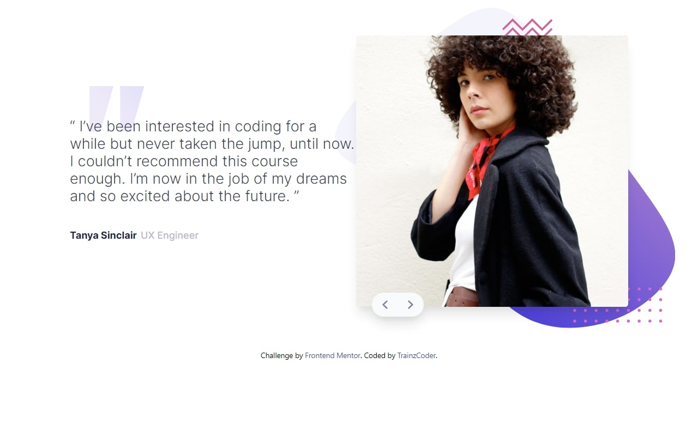

# Frontend Mentor - Coding bootcamp testimonials slider solution

This is a solution to the [Coding bootcamp testimonials slider challenge on Frontend Mentor](https://www.frontendmentor.io/challenges/coding-bootcamp-testimonials-slider-4FNyLA8JL). Frontend Mentor challenges help you improve your coding skills by building realistic projects.

- Navigate the slider using either their mouse/trackpad or keyboard

### Screenshot

### Links

- Live Site URL: [Click Here](https://coding-bootcamp-trz.netlify.app)

## My process

### Built with

- Semantic HTML5 markup
- CSS custom properties
- Flexbox
- Mobile-first workflow
- [Tailwind CSS](https://tailwindcss.com/)

## Author

- Frontend Mentor - [@trainzCoder](https://www.frontendmentor.io/profile/trainzCoder)
